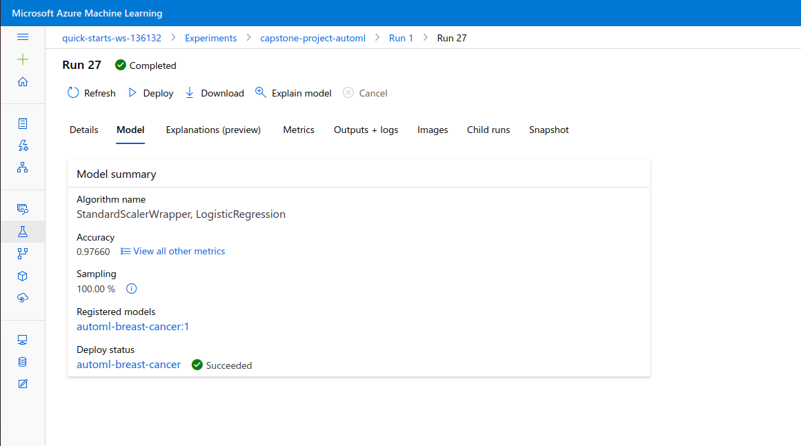
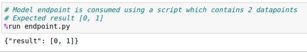

# Capstone Project - Machine Learning with Microsoft Azure

*This project is part of the Machine Learning Engineer with Microsoft Azure Nanodegree Program by Udacity & Microsoft.* 

## Project Overview 

In this project, two models are created for the [Winconsin Breast Cancer](https://www.kaggle.com/uciml/breast-cancer-wisconsin-data) dataset from Kaggle. One model is created using **Automated ML (AutoML)** and the second model is a custom-coded **Random Forest model** whose hyper parameters are tuned using **HyperDrive**. The performance of both the models are compared and the best model is deployed. The model can then be consumed from the generated REST endpoint. 

## Project Set Up and Installation

### Create a Workspace
An Azure workspace is a container that includes data and configuration information. An Azure subscription is required to create a workspace. There are different ways to create a workspace. 
[Documentation - Create and manage Azure Machine Learning workspaces](https://docs.microsoft.com/en-us/azure/machine-learning/how-to-manage-workspace?tabs=python#connect-to-a-workspace)

### Setup Docker for Running Swagger on Localhost (Optional)
[Get Docker](https://docs.docker.com/get-docker/)

## Dataset

### Overview
For this project, the dataset chosen is the **[Winconsin Breast Cancer](https://www.kaggle.com/uciml/breast-cancer-wisconsin-data)** dataset from Kaggle. There are a total of 32 columns which includes, 
Attribute information:
<ul>
    <li>ID Number</li>
    <li>Diagnosis (M = malignant, B = benign)</li>
</ul>
and real-valued features computed from digitized image of a Fine Needle Aspirate of a breast mass and describes the characteristics of the cell nuclei present in the image,
<ul>
    <li>radius (mean of distances from center to points on the perimeter)</li>
    <li>texture (standard deviation of gray-scale values)</li>
    <li>perimeter</li>
    <li>area</li>
    <li>smoothness (local variation in radius lengths) </li>
    <li>compactness (perimeter^2 / area - 1.0) </li>
    <li>concavity (severity of concave portions of the contour) </li>
    <li>concave points (number of concave portions of the contour)</li>
    <li>symmetry</li>
    <li>fractal dimension ("coastline approximation" - 1)</li>
</ul>
The mean, standard error and "worst" or largest (mean of the three
largest values) of these features were computed for each image,
resulting in 30 features.

### Exploratory Data Analysis
The dataset is analysed in this project. The following steps were down for data analysis:  
#### 1. Check for Null Values: 
There were no null or missing values in the dataset.  
#### 2. Visualise Features and Target: 

 
All the features were visualised using histograms and box plots. 
The details are documented in [eda.ipynb](./eda.ipynb).

#### 3. Encode Non-numerical Values
The column *diagnosis* was encoded using LabelEncoder from Scikit-learn as:  Malignant - 1 and Benign - 0.  

The dataframe was then saved as a Comma Separated Values (CSV) file.

### Task
The task here to classify the given details of the FNA image as malignant or benign and thus a **binary classification** algorithm is required. All the features except the *ID Number* is being used for training the model and the column *diagnosis* is considered as the taget variable. 

### Making the Dataset Accessible

Once the dataset is analysed and prepared, it is uploaded to this GitHub repository from where the raw URL of the file is obtained. The dataset is accessed from the workspace through this URL.  
`web_path = "https://raw.githubusercontent.com/JoanneJons/azure-machine-learning-capstone/main/breast-cancer-dataset.csv?token=AJ5V2OGXYLJ22BGYXN4EUODAC6P4K"`

## Automated ML

### Automated ML Configuration

For this project, AutoML was configured using an instance of the  `AutoMLConfig` object. The following parameters were set: 
1. `experiment_timeout_minutes = 30` 
*Maximum amount of time in minutes that all iterations combined can take before the experiment terminates.* 
For this project, this has been set as 30 because of the time restrictions of Udacity labs.  
2. `task = 'classification'` 
*The type of task to run depending on the automated ML problem to solve.* 
This project handles a binary classification task.  
3. `compute_target=cpu_cluster` 
*The Azure Machine Learning compute target to run the AutoML experiment on.* For this experiment, a compute cluster called `cpu_cluster` is created before configuring AutoML. This computer cluser is *STANDARD_D2_V2* with a maximum of 4 nodes.
  
4. `training_data = train_data` 
*The training data to be used within the experiment.* Here `train_data` is a TabularDataset loaded from a CSV file.  
5. `primary_metric = 'accuracy'` 
*The metric that AutoML will optimize for model selection.*  
6. `label_column_name = 'diagnosis'` 
*The name of the label column.* Here the target column is 'diagnosis' which specifies whether the instance is malignant (1) or benign (0).  
7. `n_cross_validations = 5` 
*The number of cross validations to perform when user validation data is not specified.*  

### Automated ML Run

Submit the experiment and pass the `AutoMLConfig` instance. The `RunDetails` widget shows the the training process and details during the run. 

After the run is completed, the Experiment tab shows the status of the run as *Completed* as seen in the screenshot below. 

The run details page shows more information about the run, like the duration, compute target, run ID, run summary and best model summary. 

In this experiment the following models were trained by AutoML during the run. The advantage of using AutoML is that a lot of algorithms are tried out in a very short amount of time and an optimal one can be easily chosen.  

### Results

In this experiment, AutoML generated a model which uses the **Standard Scaler Wrapper and Logistic Regression** algorithm and has shown an accuracy of **0.97660**.

### Hyperparameters Generated

**Logisitic regression** is a binary classification algorithm which uses the logistic function. This function approximates the probability of a set of binary classes (1/0). The following hyperparameters were generated for the model by AutoML:  
1. `C = 0.8286427728546842` 
**Inverse of regularization strength.** 
In any Machine Learning model, there is a chance of overfitting, which is a phenomenon where the model becomes 'too comfortable' with the training data that it does not generalize well. Regularization combats overfitting by making the model coefficients smaller. A larger C means less regularization and smaller C means better regularization.  

2. `class_weight = None` 
**Denotes the weights associated with classes.** 
None denotes that all classes are supposed to have weight one. 

3. `dual = False` 
**Dual or primal formulation.** 
It is not prefered to be implemented when number of samples is greater than the number of features.  

4. `fit_intercept=True`  
**Specifies if a constant should be added to the decision function.** 

5. `intercept_scaling=1`  
**Used only when the solver 'liblinear' is used, default=1.** 

6. `l1_ratio=None` 
**Elastic-Net mixing parameter and is only used if penalty='elasticnet'.** 

7. `max_iter=100` 
**Maximum number of iterations taken for the solvers to converge.** 

8. `multi_class='multinomial'` 
**Method of fitting labels** 
For ‘multinomial’ the loss minimised is the multinomial loss fit across the entire probability distribution, even when the data is binary. 

9. `n_jobs=1`  
**Number of CPU cores used when parallelizing over classes.** 

10. `penalty='l1'`  
**Used to specify the norm used in the penalization.** 
L1 regularization adds an L1 penalty equal to the absolute value of the magnitude of coefficients. 

11. `random_state=None` 
**Used when solver == ‘sag’, ‘saga’ or ‘liblinear’ to shuffle the data.** 
                                    
12. `solver='saga'`  
**Algorithm to use in the optimization problem.** 
'saga' is the extension of Stochastic Average Gradient descent that also allows for L1 regularization. It is a variation of gradient descent and incremental aggregated gradient approaches that uses a random sample of previous gradient values. 

13. `tol=0.0001`  
**Tolerance for stopping criteria.** 

14. `verbose=0` 
**Verbosity** 

15. `warm_start=False` 
**Reuse the solution of the previous call to fit as initialization.** 

**Standard scaler wrapper** is used to standardize and scale the values of the features. This is done because machine learning algorithms perform better when features are on a relatively smaller scale. In this dataset, different features are measured using different units and the scale varies. Thus, standardizing the values and changing the range of the values before applying logisitc regression will result in a better performance. The model used the default values of the hyperparameters, which are:  

1. `copy = True` 
**Create a copy for doing scaling.** 

2. `with_mean = True` 
**Center the data before scaling.** 

3. 1`with_std = True` 
**Scale the data to unit variance.** 

### Explainability

Azure Automated ML has a feature called *Explainability* which shows information about the data after the model is trained. In this experiment, the *Explainability* tab visualised the importance of each feature in the dataset. This gives ingsights about how to improve the dataset in the future and get better performances. 

### Save and Register the Best Model

The best model from the AutoML run is registered into the workspace. 

## Hyperparameter Tuning

### Random Forest Model
The random forest is an ensemble algorithm which can be used for both classification and regression. The algorithm creates multiple decision trees on randomly selected data samples, gets prediction from each tree and selects the best solution by means of voting. This algorithm was chosen because it is considered as highly accuracte, robust and powerful. 

The random forest model requires many hyperparameters, of the which the following parameters and their hyperparameter spaces were selected. 

1. `n_estimator` (int) 
**The number of trees in the forest.** 

2. `min_samples_split` (int) 
**The minimum number of samples required to split an internal node.** 

3. `max_features` {'auto', 'sqrt', 'log2'} 
**The number of features to consider when looking for the best split.** 
This function is applied on the number of features. 

4. `bootstrap` (bool) 
**Whether bootstrap samples are used when building trees.** 

### HyperDrive Configuration

The parameters required for the HyperDrive run is configured using an instance of the HyperDriveConfig object.  

**Early Termination Policy** 
Automatically terminating poorly performing runs with an early termination policy improves computational efficiency. In this experiment, Bandit policy is used. Bandit policy is based on slack factor/slack amount and evaluation interval. Bandit terminates runs where the primary metric is not within the specific slack factor/slack amount comapred to the best performing run. The primary metric for the experiment is accuracy.

The following configuration parameters were specified:
1. `evaluation_interval=2` 
    The policy is applied every other time the training script logs the primary metric.
2. `delay_evaluation=5` 
    The first policy evaluation is delayed to avoid premature termination.
3. `slack_factor=0.1` 
    Any run whose best metric run is less than (1/(1+0.1)) or 91% of the best performing run will be terminated.

**Sampling Method and Space** 
Since all the hyperparameters are discrete, their space is defined as a `choice` among discrete values.  
`'--n_estimator': choice(100, 200, 500, 800, 100)` 

`'--min_samples_split': choice(2, 5, 10)` 

`'--max_features': choice('auto', 'sqrt', 'log2')` 

`'--bootstrap': choice(True, False)` 

The parameter sampling method used here is **random sampling**, which supports both discrete and continuous hyperparameters. It also supports early termination. The hyperparameter values are randomly selected from the defined search space. 

### Hyperdrive Run

Submit the experiment and pass the `HyperDriveConfig` instance. The `RunDetails` widget shows the the training process and details during the run.

After the run is completed, the Experiment tab shows the status of the run as *Completed* as seen in the screenshot below. 

The run details page shows more information about the run, like the duration, compute target, run ID, run summary and best model summary. 

During the run, multiple child runs were run with different combinations of hyperparameters. The following screenshot shows the different child runs and the **logged metrics during the training process**.

### Results
The best run generated the following values for hyperparameters and gave an accuracy of **0.97660**.

1. `bootstrap = True`
2. `max_features = 'auto'`
3. `min_samples_split = 2`
4. `n_estimators = 100`

The following screenshot shows further details of the best run.

### Save and Register Best Model

The best model from the HyperDrive run is registered into the workspace. 

## Model Deployment

**Accuracy of AutoML Model = 0.97660  
Accuracy of HyperDrive tuned Random Forest Model = 0.97660** 

Since both models have equal accuracy, either of them could be chosen for deployment. In this project, the AutoML model is deployed.  

Once the model is registered into the workspace, a entry script is defined. The entry script receives data submitted to a deployed web service and passes it to the model. It then takes the response returned by the model and returns that to the client. The script is specific to the model.  

There are two functions in the entry script:  
1. Loading model (using `init()`)
2. Running model on input data (using `run()`)

The [scoring script](./score.py) can be coded or it can be downloaded from the files generated by AutoML run. 
A file containing the [environment](./myenv.yml) details and dependencies is also downloaded.  

**Azure Container Instances (ACI)** is a great solution for any scenario that can operate in isolated containers, including simple applications, task automation, and build jobs. It offers the fastest and simplest way to run a container in Azure, without having to manage any virtual machines and without having to adopt a higher-level service.  

ACI is configured using `AciWebservice.deploy_configuration()` and it is passed to the model's deploy method. The entry script is also passed after instantiated as a InferenceConfig instance.  During deployment, the **authentication** and **application insights** are enabled. 

If the deployment is successful, the endpoints tab displays the service.

In the details page, the deployment status will be stated as 'Healthy' and other details is specified. 

The details required for consuming: REST endpoint and the primary & secondary keys are displayed in the Consume page. 

## Consuming Model Enpoint

**Swagger** can be used to view the REST API documentation. The details of the deployment includes [Swagger URI](./images/swagger.json) which is a JSON file that is to be downloaded. Swagger is hosted on localhost using [serve.py](./serve.py) and [swagger.sh](./swagger.sh).

In this experiment, the model is consumed using the POST method.

The script [endpoint.py](./endpoint.py) is used to interact with the endpoint. The scoring URI and the key of the deployment is used. It contains the following two sample data instances  

The result was obtained as follows. 

Since application insights were enabled after deployment, it can be viewed using the Application Insights URL.

## Resources Clean Up

After the experiment is done, the service and the compute cluster is deleted.

## Screen Recording

[Link to Screen Recording]()

## Further Improvements
1. The AutoML run gave insights on how important each feature is. So in future experiments, the dataset can be manipulated and prepared better. 
2. HyperDrive requires sampling method and early termination policies. Random sampling & bandit policy is used in this experiment, but in future experiments, they can be changed to other options and the performance can be compared. 
3. A user interface can be created for interacting with the endpoint. 
